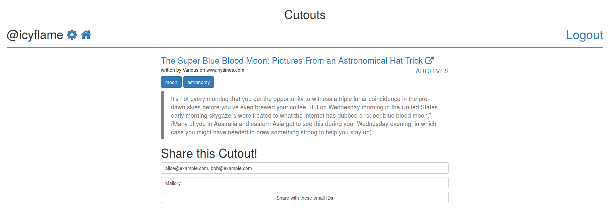
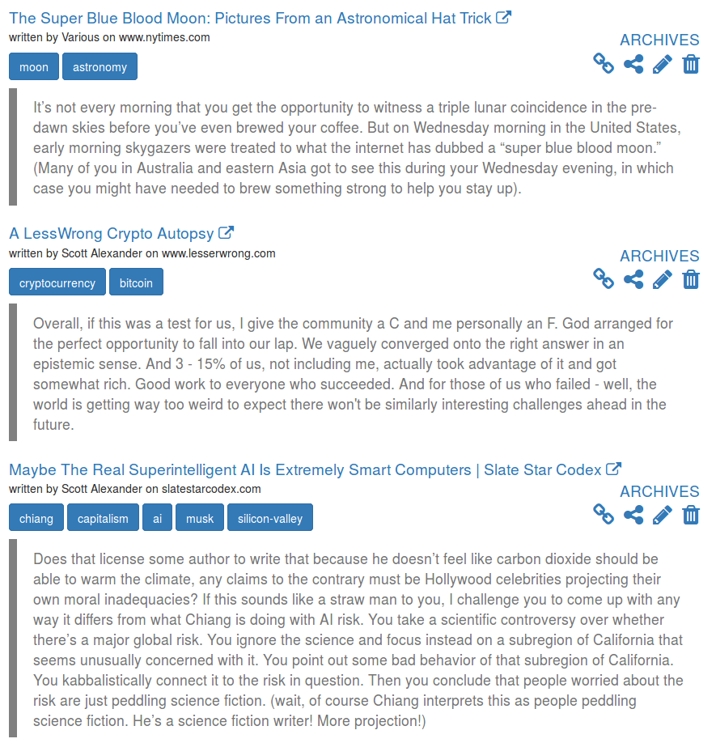

# cutouts

> Sign up, and start adding the articles that you have read and want to remember! Deployed [here][11]!

[![Build Status][9]][10]

You can find the Firefox companion add-on [here][8]

### TOC

- [What?][1]
- [Why?][2]
- [Manual Test Plan][3]
- [API Documentation][7]
- [Release Notes][4]
  - [v1.0 - 2018-12-07][5]
- [TODO][6]

## What?

- Simple form with just two compulsary questions: Link and a Quote from the article that you want to remember
- As simple as it can get. Nothing fancy. Vanilla bootstrap. Vanilla font awesome.
- List public cutouts at profile page
- Share a single cutout with friends and family by emailing it to them
- Share a cutout on social media by copying it's permalink

## Why?

The internet has a lot of good content, blog posts, articles, etc etc. I read a lot
of stuff, and then could not find them again when I wanted to. Pocket is good for saving
for later, Delicious and Pinterest are overkill for something as simple. Hence, this 
project!

## Manual Test Plan

- login and logout
- login, add a public cutout, check that it is accessible without login, logout
- login, add an unlisted cutout, check that it is accessible without login, logout
- login, add a private cutout, ensure that it isn't accessibly without login,
    logout
- edit an cutout's visibility and check if the changes are reflected

## API Documentation

> Check the [routes][13] file for the latest available routes

All responses are JSON formatted.

### `GET /api/v1/feed`

- Returns the list of top 20 articles from the public feed
- Public
- Auth not required
- Rate limited

### `GET /api/v1/feed/:username`

- Returns the top 20 public articles of the given user
- Public
- Auth not required
- Rate limited

## Release Notes

### v1.0 - 2018-02-07

- Add, update, delete cutouts
- Tag cutouts and then search the cutouts in a particular tag
- List all the cutouts you have stored in the past
- Export all your cutouts to UTF8 encoded HTML or JSON
- Share the permalink for an article that has the title of the article, the
    quote, the author and it's tags

    

- Email a Cutout to friends and family (maximum 5 at once)

    

- Add an alias while emailing so that recipients know the cutout is from you
- Display tags as Bootstrap buttons

    

- A link to the archives of the page that has the Cutout
- A companion 
    [Firefox add-on][8]
    to make it easier to Cutout articles from Firefox

## TODO

> In descending order of priority

- [x] Create a good homepage that has a few words about why this project at all
- [ ] User must be able to login with both username as well as email
	- Override devise? (Devise procedure [here][12] seems extremely long)
- [ ] Fix the word limit on quote (50 words?)
- [x] Fix the sign-in and sign-up form UI
- [x] Fix the horrible UI to make it usable at the very least (copy medium, that interface is too good!)
- [x] A system to tag articles (single words)
- [x] A system to search for articles (single search bar, user search, tag search, author search, quote search)
- [x] Ability for users to export their articles into a Markdown file for local storage (A JSON file for import too?)
- [ ] A rating system for self, no sharing as yet
- [ ] Probably friendship and the ability to follow other users

Code inside this repo is licensed under MIT.

Copyright (c) 2015-2019 [Siddharth Kannan](http://icyflame.github.io) All Rights Reserved.

[1]: #what
[2]: #why
[3]: #manual-test-plan
[4]: #release-notes
[5]: #v10---2018-02-07
[6]: #todo
[7]: #api-documentation
[8]: https://addons.mozilla.org/en-US/firefox/addon/cutouts-firefox-extension/
[9]: https://travis-ci.org/icyflame/cutouts.svg?branch=master
[10]: https://travis-ci.org/icyflame/cutouts
[11]: https://cutouts.siddharthkannan.in
[12]: https://github.com/plataformatec/devise/wiki/How-To:-Allow-users-to-sign-in-using-their-username-or-email-address
[13]: https://github.com/icyflame/cutouts/blob/add-api-documentation/config/routes.rb
